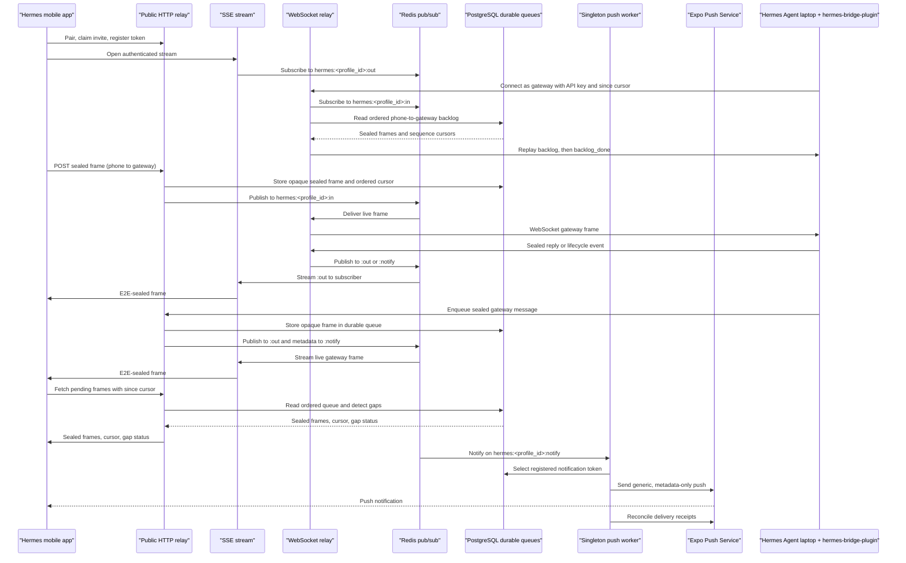

# Hermes Bridge Relay

Standalone HTTP, WebSocket, and push-worker distribution for Hermes Bridge. The relay connects the Hermes mobile app to a Hermes Agent gateway running on your laptop. The laptop must have the [hermes-bridge-plugin](https://github.com/valinagacevschi/hermes-bridge-plugin) installed in Hermes; the relay alone does not connect to Hermes.

## Architecture



PostgreSQL stores pairing records, API keys, sealed blobs, and durable message queues. Redis carries live relay traffic and notification metadata; pub/sub itself is not durable, so clients replay from PostgreSQL after reconnecting. Gateway-to-phone and phone-to-gateway queues have separate ordered sequence spaces and `msg_id` deduplication. The phone pending endpoint reports cursor gaps when gateway-to-phone rows have expired or been evicted.

### End-to-end encryption boundary

The app and plugin seal message frames and attachment blobs end to end. The relay stores and routes opaque ciphertext; it does not have the profile PSK and cannot decrypt message or blob contents. Push payloads contain only generic notification text and structural metadata such as profile, category, event type, and routing identifiers. Plaintext message content is never included in relay push payloads.

## Capabilities

- Self-service profile provisioning and single-use pairing invites, plus admin-created invites.
- API-key and profile-scoped authorization for paired clients and relay operations.
- Bidirectional relay of E2E-sealed frames, with durable queues and replay in both directions.
- Ordered cursors, message-ID deduplication, and gap detection for phone queue replay.
- Streaming server-sent events (SSE) for gateway-to-phone delivery.
- WebSocket gateway transport with a capability handshake and gateway reconnect replay; optional mobile WebSocket receive role.
- Synchronous RPC requests from phone to gateway with correlated replies.
- Attachments uploaded and fetched as sealed blobs.
- Signed lifecycle events, sanitized structural metadata, and notification categories.
- Push-token registration, Expo push delivery, receipt reconciliation, and permanent dead-token pruning.
- Redis-backed rate limiting and pub/sub.
- Queue, blob, and stale-data retention pruning.
- Health and liveness endpoints; Docker and Kubernetes deployment examples.

## HTTP API reference

HTTP listens on port `3000` by default. The public HTTP routes are listed below; streaming SSE is handled directly by the Node HTTP adapter so responses are not buffered by the Expo adapter.

| Method | Path | Purpose | Authentication |
| --- | --- | --- | --- |
| `GET` | `/api/live` | Process liveness check. | None |
| `GET` | `/api/health` | Check PostgreSQL connectivity. | None |
| `POST` | `/api/pair/provision` | Self-service provisioning and invite creation; rate-limited by Redis. | None |
| `POST` | `/api/pair/claim` | Claim a single-use invite and issue a profile API key; accepts invite token and secret. | Invite credentials in request body |
| `POST` | `/api/admin/invites` | Create an invite for a profile. | Authorization header with ADMIN_SECRET |
| `POST` | `/api/push/register` | Register an Expo push token for the authenticated profile. | Authorization header with the profile API key |
| `POST` | `/api/notify` | Publish a profile notification payload to Redis. | Authorization header with the profile API key |
| `POST` | `/api/relay/message` | Relay a phone message or RPC request to its profile's gateway. | Authorization header with the profile API key; profile must match |
| `POST` | `/api/relay/enqueue` | Persist and publish a gateway-to-phone sealed frame. | Authorization header with the profile API key |
| `GET` | `/api/relay/pending/<profile_id>` | Replay queued gateway-to-phone frames after `since`; returns cursor and gap status. | Authorization header with the profile API key; profile must match |
| `GET` | `/api/relay/stream/<profile_id>` | Subscribe to gateway-to-phone frames as an SSE stream. | Authorization header with the profile API key; profile must match |
| `POST` | `/api/relay/blob?profile_id=<profile_id>&mime=<mime>` | Store a raw E2E-sealed attachment blob. | Authorization header with the profile API key; profile must match |
| `GET` | `/api/relay/blob/<id>` | Fetch a sealed blob; authorization is checked against its owning profile. | Authorization header with the owning profile API key |
| `POST` | `/api/relay/events` | Verify and publish a signed lifecycle event as a categorized notification. | X-Hub-Signature-256 HMAC using the profile API key; fresh timestamp required |

### WebSocket gateway transport

The WebSocket process listens on port `8082` by default, separately from HTTP. Route `/ws/` to this port through the ingress and allow WebSocket upgrades.

Connect to `/ws/hermes/:profile_id?api_key=hb_…`. The `api_key` query parameter must belong to `:profile_id`. The default role is `gateway`: the laptop plugin reads phone-to-gateway traffic, receives a `hello` capability descriptor and ordered backlog replay, and writes gateway frames or synchronous RPC replies. Set `role=mobile` for a phone WebSocket receive fallback (for proxies that buffer SSE); this role receives gateway-to-phone frames only, while phone sends still use HTTP. Gateway reconnects can pass `since=<cursor>` to replay phone-to-gateway queued frames.

## How push notifications work

An authenticated HTTP notification or relay event publishes a JSON payload to `hermes:<profile_id>:notify`. The singleton push worker subscribes to that Redis channel pattern, selects the notification token for the profile (the most recently paired registered device), sends the payload to Expo Push Service, and tracks accepted ticket IDs. It periodically reconciles Expo receipts and removes tokens that Expo reports as permanently dead; transient errors are retained for later recovery. The worker also prunes expired durable queue entries and sealed blobs.

Run exactly one push worker across the deployment. Multiple workers would each receive the Redis pub/sub notification and could send duplicate pushes. Pushes are generic and metadata-only: message plaintext is never sent to the relay or Expo.

## Setup

Follow these steps on the relay host, then on the laptop that runs Hermes Agent.

1. **Install prerequisites.** Use Hermes Agent 0.21 or newer on the laptop. Node.js 20 is required for relay development and deployment tooling. Provide PostgreSQL and Redis reachable by the relay, a public hostname with HTTPS/WSS and ingress support for WebSocket upgrades, and Expo push credentials/configuration in the mobile app's Expo project when push notifications are needed. The relay sends pushes through Expo's push service; it does not need an Expo credential environment variable.

2. **Clone the relay and install dependencies.**

   ```sh
   git clone https://github.com/valinagacevschi/hermes-bridge-relay.git
   cd hermes-bridge-relay
   npm install --legacy-peer-deps
   ```

3. **Configure the environment.** Create `.env` in the repository root. Replace every uppercase placeholder with your own value; these example values contain no real hostname or secret.

   ```dotenv
   DATABASE_URL="postgresql://DB_USER:DB_PASSWORD@DB_HOST:5432/DB_NAME"
   REDIS_URL="redis://REDIS_HOST:6379"
   PUBLIC_URL="https://RELAY_HOST"
   ADMIN_SECRET="REPLACE_WITH_A_LONG_RANDOM_SECRET"
   PORT="3000"
   RELAY_WS_PORT="8082"
   ```

   Keep this file private and provide the same connection/configuration values to each relay process. `ADMIN_SECRET` is only needed for admin invite creation; self-service pairing does not use it.

4. **Back up PostgreSQL, then initialize or migrate the schema.** Use the exact package scripts below. Take and verify a database backup before running against production: `db/schema.sql` uses idempotent table creation and additive changes so it can run on rollout, but it also contains a one-time teardown of legacy team tables/columns, including `tenants`.

   ```sh
   npm run build:runtime
   npm run db:migrate
   ```

5. **Build and start the three processes.** Keep each command running in its own terminal/container. HTTP uses port `3000` by default; WebSocket uses `8082`; the push worker has no inbound port and must run exactly once across the deployment.

   HTTP:
   ```sh
   npm run start:http
   ```

   WebSocket:
   ```sh
   npm run start:ws
   ```

   Push worker (one replica/process only):
   ```sh
   npm run start:push
   ```

   Route `/` to HTTP and `/ws/` to WebSocket, enable WebSocket upgrades, and disable proxy buffering for `/api/relay/stream/`. The Docker image defaults to HTTP; Kubernetes supplies distinct HTTP, WebSocket, and singleton push-worker commands/containers.

6. **Deploy with Docker or Kubernetes.** For Docker, build the image from the repository root. The image starts HTTP by default; run separate containers with the WebSocket and push commands, using the same environment values and exactly one push container.

   ```sh
   docker build -t IMAGE .
   ```

   For Kubernetes, set these placeholders to your image reference and public hostname. `envsubst` substitutes them in the included manifests before applying:

   ```sh
   export IMAGE="REGISTRY/IMAGE:TAG"
   export RELAY_HOST="YOUR_RELAY_HOSTNAME"
   kubectl apply -f kubernetes/namespace.yaml
   envsubst < kubernetes/configmap.yaml | kubectl apply -f -
   kubectl apply -f kubernetes/service.yaml
   envsubst < kubernetes/deployment.yaml | kubectl apply -f -
   envsubst < kubernetes/ingress.yaml | kubectl apply -f -
   kubectl -n hermes-bridge rollout status deployment/relay
   kubectl -n hermes-bridge rollout status deployment/relay-push
   ```

   The deployment manifest expects `relay-config` and a `relay-secrets` Secret containing `DATABASE_URL`, `REDIS_URL`, and `ADMIN_SECRET`. Supply Kubernetes Secrets out-of-band through your cluster's secret-management process; do not apply a secret manifest from this repository. The manifests configure two HTTP/WebSocket relay replicas and one push worker.

7. **Install and pair the laptop plugin.** On the Hermes laptop, install the plugin, pair it to create its relay profile and one-time phone invite, then restart the gateway. The plugin is required: it is the laptop-side gateway connection that lets the relay reach Hermes.

   ```sh
   hermes plugins install valinagacevschi/hermes-bridge-plugin/hermes_bridge
   python3 ~/.hermes/plugins/hermes_bridge/pair.py
   hermes gateway restart
   ```

   Scan the pairing QR in the Hermes Bridge app. After pairing, check the plugin and gateway:

   ```sh
   python3 ~/.hermes/plugins/hermes_bridge/pair.py --check
   hermes plugins doctor hermes_bridge
   hermes gateway status
   ```

8. **Verify the deployment.** From a machine that can reach the public hostname, check liveness and PostgreSQL health. For WebSocket, use `websocat` with a real paired profile ID and API key; the key is sensitive. The `/ws/hermes/...` endpoint returns the gateway handshake/backlog after connection.

   ```sh
   curl -fsS https://RELAY_HOST/api/live
   curl -fsS https://RELAY_HOST/api/health
   websocat 'wss://RELAY_HOST/ws/hermes/PROFILE_ID?api_key=API_KEY'
   ```

   The HTTP routes return success when the process is live and when PostgreSQL is reachable, respectively. On the laptop, `pair.py --check`, plugin doctor, and gateway status confirm local plugin readiness and gateway state.

9. **Review configuration.**

   | Variable | Purpose | Required |
   | --- | --- | --- |
   | `DATABASE_URL` | PostgreSQL connection used for durable data and migrations. | Yes |
   | `REDIS_URL` | Redis connection for pub/sub and rate limiting. | Yes |
   | `PUBLIC_URL` | Public relay base URL used in admin invite links. | For admin invite links |
   | `ADMIN_SECRET` | Bearer secret for `POST /api/admin/invites`. | Only for admin invites |
   | `PORT` | HTTP listener port; defaults to `3000`. | No |
   | `RELAY_WS_PORT` | WebSocket listener port; defaults to `8082`. | No |

## Run locally

Requirements: Node.js 20, PostgreSQL, and Redis.

```sh
npm install --legacy-peer-deps
npm run build:runtime
npm run db:migrate
npm run start:http
npm run start:ws    # separate terminal
npm run start:push  # separate terminal; exactly one worker
```

Set `DATABASE_URL` and `REDIS_URL` for all processes. Set `PUBLIC_URL` to the operator-configured public relay URL used in admin invite links, and `ADMIN_SECRET` to enable `POST /api/admin/invites`. `PORT` (HTTP, default `3000`) and `RELAY_WS_PORT` (WebSocket, default `8082`) are optional. Configure the public ingress to route `/ws/` to WebSocket and `/` to HTTP, allow WebSocket upgrades, and disable proxy buffering for `/api/relay/stream/`.

## Build and checks

```sh
npm test
npm run typecheck
npm run build
npm run build:runtime
docker build -t hermes-bridge-relay .
```

The Docker image runs HTTP by default. Run the compiled WebSocket and push-worker processes as separate commands/deployments. `kubernetes/` contains deployment examples; provide your own database, Redis, ingress host, TLS issuer, image pull secret, and Kubernetes Secrets. The deployment init container runs the idempotent schema on each rollout. Review `db/schema.sql` and take a database backup before production migration; the schema includes a one-time teardown of legacy team tables and columns.

## License

This repository is licensed under the MIT License. See [LICENSE](LICENSE).
